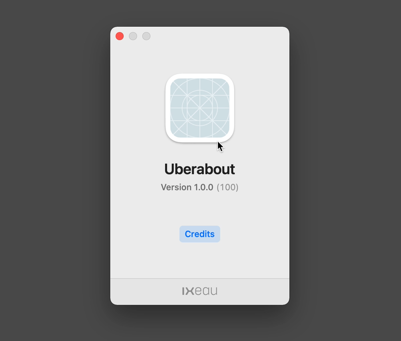

# Uberabout

Let’s be honest: The default “About” window in macOS apps looks like a relict of past times. It’s a forgotten niche of the Mac culture — so I made `Uberabout`! It replaces the default “About” window with a modern looking and fun one. Even though most of your users will never look at this window, remember: God is in the details!



## 🎛 Config

Uberabout automatically detects name, version, app icon and copyright based on the specified `Bundle`.

Additionally you can add an URL that points to your credits, define a organization logo or set an image for the backside of the app icon.

```swift
UberaboutView(bundle: Bundle.main,
              appIconBackside: Image("uberaboutIconBack"),
              creditsURL: "http://ixeau.com",
              organizationLogo: Image("uberaboutOrgaLogo"))
```

## 📼 Requirements
- macOS 11.0+

## 🌀 Support me
I’m Martin, an indie dev from Berlin. If you find Uberabout useful, please consider to support my work! You can find some great apps of mine on the [Mac App Store](https://apps.apple.com/developer/id955848754) 🌀
